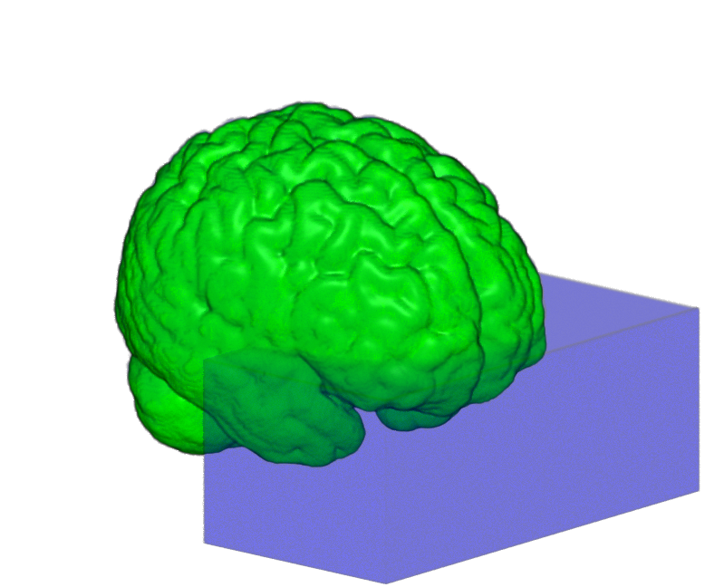

# t2log-hybrid

This tool provides hybrid T2w- and T1w-based masking for FastSurfer-based T1w cortical reconstruction within an HCP-style processing workflow using FreeSurfer’s mri_synthstrip.

The method combines log-transformed T2w-based statistical refinement with a T1w-derived SynthStrip brain mask. Outside a predefined inferior-anterior region, the refined T2w mask is constrained by the T1w brain mask. Within this region, the T2w-derived mask is replaced by the T1w-derived brain mask alone.

---

## Overview

T2-weighted images may exhibit local signal loss, particularly in susceptibility-prone regions such as the orbitofrontal cortex. When T2w-based statistical refinement is applied uniformly, such local signal loss can lead to excessive exclusion of cortical tissue.

**t2log-hybrid** incorporates a T1w-derived anatomical brain envelope to reduce this effect while retaining T2w-based refinement across the remainder of the brain. The resulting hybrid mask is intended for FastSurfer-based T1w cortical reconstruction within an HCP-style processing workflow and supports practical downstream T1w/T2w-derived myelin mapping.

Outside the predefined inferior-anterior switching region, the refined T2w mask is intersected with the T1w SynthStrip brain mask. Within the switching region, the T2w-derived mask is replaced by the T1w-derived brain mask alone.

---

## Key Concept

- **T2w-based refinement**
  - The SynthStrip-derived T2w brain image is log-transformed and statistically thresholded to reduce residual non-brain signal.

- **T1w-derived brain envelope**
  - The T1w SynthStrip brain mask is used as an anatomical brain-envelope constraint.
  - No additional T1w intensity-based thresholding is applied.

- **Spatial hybridization**
  - Outside the predefined inferior-anterior switching region, the refined T2w-derived mask is intersected with the T1w-derived brain mask.
  - Within the switching region, the T2w-derived mask is replaced by the T1w-derived brain mask alone.

- **AC-referenced switching region**
  - The switching region is defined relative to the anterior commissure (AC).
  - It extends across the full left-right dimension and includes tissue anterior and inferior to the AC.

- **Final mask refinement**
  - The combined mask undergoes one erosion followed by one mean dilation to remove isolated residual components while maintaining spatial continuity.

---

## Protocol-specific parameter setting

Masking parameters are determined for each imaging protocol rather than optimized separately for individual subjects.

For a new acquisition protocol, intensity histograms and resulting masks are inspected in a small number of representative subjects to identify appropriate values for `border_num` and `SD_FACTOR_T2`.

Once selected, the same parameter settings are applied to all subjects acquired with that protocol.

Differences in image contrast across acquisition protocols may therefore require separate parameter selection, while subject-by-subject tuning is not part of the intended workflow.

---

## Parameter selection workflow

### 1. Initial `border_num` Selection

In the `# --- Configuration ---` section:

- `border_num=1`: tighter extraction
- `border_num=2`: more conservative (use if over-stripping occurs)

---

### 2. Protocol-level selection of `SD_FACTOR_T2`

Use intensity histograms and resulting masks from a small number of representative subjects to select an appropriate `SD_FACTOR_T2` for the imaging protocol:

- **1.960 (95%)**: standard starting point
- **2.241 (97.5%)**: intermediate
- **2.576 (99%)**: conservative (use if brain tissue is removed)

👉 Goal: preserve brain tissue while reducing residual non-brain signal.

> **Tip:** Prioritize avoiding over-stripping.

---

## Usage

### 1. Setup

Edit the configuration in `t2log-hybrid.sh`:

    # --- Configuration ---
    Subjlist="001 002 003"
    BASE_PATH="/path/to/your/project"
    border_num=2
    SD_FACTOR_T2=1.960

### 2. Execution

    chmod +x t2log-hybrid.sh
    ./t2log-hybrid.sh

### 3. Protocol-level review

Before processing the full cohort:

1. Run `t2log-hybrid` on a small number of representative subjects.
2. Review the intensity histograms and resulting masks.
3. Select `border_num` and `SD_FACTOR_T2` for the imaging protocol.
4. Apply the selected settings unchanged to all remaining subjects acquired with the same protocol.

- **If the brain is over-stripped**: increase `SD_FACTOR_T2` (e.g., to 2.576) or set `border_num=2`
- **If non-brain tissue remains**: decrease `SD_FACTOR_T2` (e.g., to 1.960) or set `border_num=1`

> **Tip:** Prioritize avoiding over-stripping when selecting protocol-level parameters.

---

## Recovery

    chmod +x recover_t2lh.sh
    ./recover_t2lh.sh

- Restores original files from `_bet.nii.gz`
- Recommended before re-running with new protocol-level parameters

---

## HCP Integration

Designed for HCP pipeline structure:

- Updates T1w and T2w brain images
- Synchronizes masks to MNINonLinear space
- Applies transforms automatically
- Creates backups before modification

The masking procedure is applied before cortical surface reconstruction and does not modify the underlying surface reconstruction algorithm.

---

## QA & Reporting

A summary CSV (`hss_t2lh_summary_*.csv`) is generated:

- intensity thresholds
- SD factors
- voxel drop rates

👉 Useful for cohort-level QA.

---

## Viewer

    ./fview_t2lh.sh [Subject_ID]

---

## Prerequisites

Ensure the following are available in your `$PATH`:

- FSL 6.0.7
- FreeSurfer 7.4.1 (`mri_synthstrip`)
- bc

---

## Citation

Hatano, K. (2026). *t2log-hybrid* (Version 4.2), a hybrid T2w- and T1w-based masking tool [Software]. GitHub.  
https://github.com/koji-hatano1/t2log-hybrid
